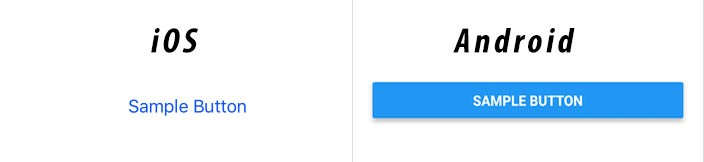

##Homework - 1

###TouchableOpacity Nedir? 

<p>'*TouchableOpacity*' react-native'de buton oluşturmak için kullanılan bir bileşen(component)dir. '*Button*' bileşeni(component) gibi kullanıcı arayüzünde buton oluşturur. '*Button*' bileşeninden farkı ise şu şekildedir. '*Button*' bileşeni(component) ile oluşturduğunuz buton ios yada android için varsayılan olarak stillendirilmiş olarak gelir. Örneğin şu kodu çalıştırırsanız,</p>

```javascript
import React from 'react';
import { View, Text, StyleSheet, Button } from 'react-native';
const basicComponent = () => {
 return (
  <View>
   <Button>Press me!</Button>
  </View>
 )
}
const styles = StyleSheet.create({})
export default basicComponent
````
bu şekilde bir çıktı alırız.<br>



<p>Yukarıdaki örnekte görüldüğü üzere '*button*' bileşeni(component) farklı platformlar için varsayılan olarak farklı stiller ile çıktı veriyor. Fakat '*TouchableOpacity*' bileşeni varsayılan olarak stilsiz olarak çıktı vermektedir. Bu nedenle StyleSheet bileşeni gibi bir stil bileşenine ihtiyaç duyarız.</p>

<p>Aşağıdaki örnekte görüleceği üzere '*TouchableOpacity*' bileşeni ile oluşturulan butona kullanıcı her bastığında ekrandaki bir sayaç butona basma sayısını ekrana basmaktadır.</p>

```javascript
import React, { useState } from "react";
import { StyleSheet, Text, TouchableOpacity, View } from "react-native";

const App = () => {
  const [count, setCount] = useState(0);
  const onPress = () => setCount(prevCount => prevCount + 1);

  return (
    <View style={styles.container}>
      <View style={styles.countContainer}>
        <Text>Count: {count}</Text>
      </View>
      <TouchableOpacity
        style={styles.button}
        onPress={onPress}
      >
        <Text>Press Here</Text>
      </TouchableOpacity>
    </View>
  );
};

const styles = StyleSheet.create({
  container: {
    flex: 1,
    justifyContent: "center",
    paddingHorizontal: 10
  },
  button: {
    alignItems: "center",
    backgroundColor: "#DDDDDD",
    padding: 10
  },
  countContainer: {
    alignItems: "center",
    padding: 10
  }
});

export default App;
```
___

___

___

___

Yukarıdaki örnekten anlaşılacağı üzere '*TouchableOpacity*' bileşenini kullanabilmemiz için ilk olarak import etmemiz gerekmetir. 

```javascript
import {TouchableOpacity} from 'react-native';
```

Syntax:

```javascript
  ...
    <TouchableOpacity />
  ...
```

### TouchableOpacity Props'ları

####1-TouchableWithoutFeedback

<p>Geçerli bir nedeniniz olmadan kullanmayın. Bu özellik ile TouchableOpacity ile oluşturduğumuz buton dokunma sonrası geribildirimi kapatır. Fakat arkaplanda butona basılmış olur.</p>

<p>TouchableWithoutFeedback sadece bir alt öğe (child) destekler. Birden fazla alt öğeye sahip olmak için 'View' bileşenine ekleyebilirsiniz. TouchableWithoutFeedback, alt öğesini klonlayarak ve ona yanıtlayıcı sahne öğeleri uygulayarak çalışır. Bu nedenle, herhangi bir aracı bileşenin bu aksesuarlardan temeldeki React Native bileşenine geçmesi gerekir. </p>

Örnek kullanım: 

```javascript
function MyComponent(props) {
  return (
    <View {...props} style={{ flex: 1, backgroundColor: '#fff' }}>
      <Text>My Component</Text>
    </View>
  );
}

<TouchableWithoutFeedback onPress={() => alert('Pressed!')}>
  <MyComponent />
</TouchableWithoutFeedback>;
```
####2- Style

<p>View bileşeninin(component) aldığı bir style özelliğini(props) alır.</p>

Örnek kullanım: 

```javascript
  <TouchableOpacity style={styles.button}>
```

####3-activeOpacity

<p>Dokunma etkinken sarılmış görünümün opaklığının ne olması gerektiğini belirler. Varsayılan değer 0.2'dir. Tip olarak sayı alır.</p>

Örnek kullanım:

```javascript
  <TouchableOpacity activeOpacity={0.8}>
```
####4-tvParallaxProperties (ios)

(Yalnızca Apple TV) Apple TV paralaks efektlerini denetleme özelliklerine sahip nesne. Obje tipinde değerler alır. Bu değerler şunlardır.


  -**enabled:** If true, parallax effects are enabled. Defaults to true.
 -**shiftDistanceX:** Defaults to 2.0.
  -**shiftDistanceY:** Defaults to 2.0.
 -**tiltAngle:** Defaults to 0.05.
  -**magnification:** Defaults to 1.0.
  -**pressMagnification:** Defaults to 1.0.
  -**pressDuration:** Defaults to 0.3.
  -**pressDelay:** Defaults to 0.0.

####5-hasTVPreferredFocus (ios)

<p>(Yalnızca Apple TV) TV tercih edilen odak. Boolean tipinde değer alır.</p>

####6-nextFocusDown (Android)
<p>TV'nin sonraki odağını aşağı alır. Sayı tipinde değer alır.</p>

####7-nextFocusForward (Android)
<p>TV sonraki odağını ileri alır. Sayı tipinde değer alır.</p>

####8-nextFocusLeft (Android)
<p>TV sonraki odağını sola alır. Sayı tipinde değer alır.</p>

####9-nextFocusRight (Android)
<p>TV sonraki odağını sağa alır. Sayı tipinde değer alır.</p>


####10-nextFocusUp (Android)
<p>TV sonraki odağını yukarı alır. Sayı tipinde değer alır.</p>


